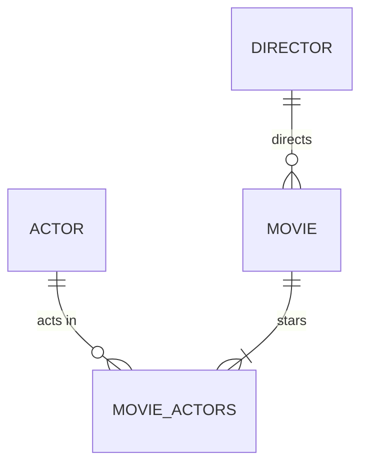
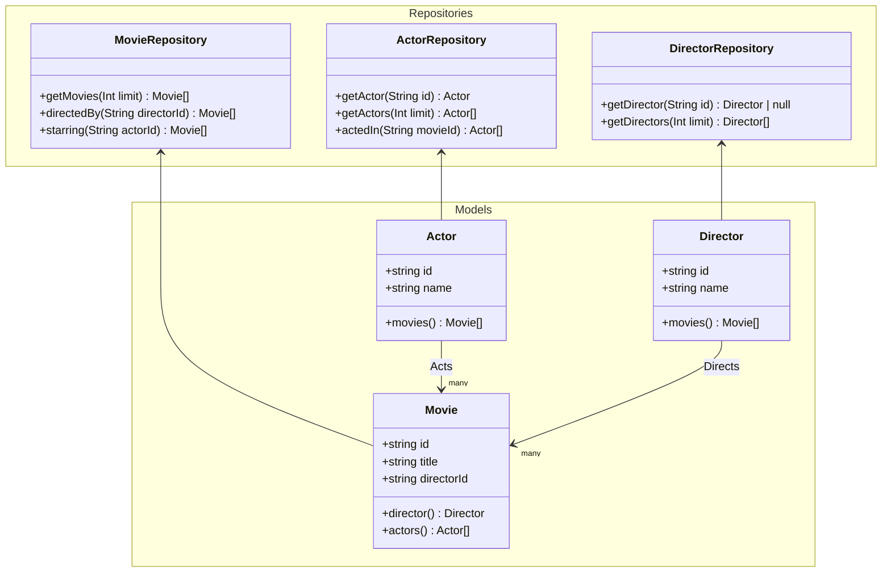

## Run

```sh
docker compose up -d
npm install
npm run start:dev
```

## Usage

Open the [GraphQL Playground](http://localhost:3000/graphql).

Run this query:

```gql
query GetMovies {
  movies {
    id
    title
    year
    actors {
      id
      name
      movies {
        id
        title
        director {
          id
          name
        }
      }
    }
    director {
      id
      name
      movies {
        id
        title
      }
    }
  }
}
```


## Relationship Diagram



## Class Diagram



